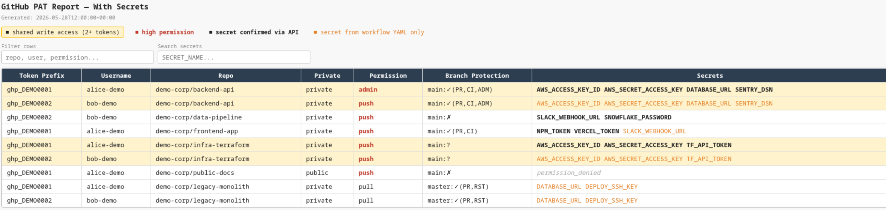

# ghp-enum

Enumerate GitHub Personal Access Tokens: repos, permissions, secrets, variables, and branch protections. Produces per-token JSON files and HTML reports.



A red team tool for situations where you have one or more GitHub Personal Access Tokens and want to understand the full blast radius: which repos each token can reach, what permission level it has, whether branch protections can be bypassed, and which secrets are exposed. Useful for mapping lateral movement paths and identifying repos where multiple tokens share write access.

## Install

```bash
git clone git@github.com:zrthstr/ghp-enum.git
cd ghp-enum
uv sync
```

## Usage

Create a `tokens.txt` with one PAT per line (`#` for comments):

```
ghp_xxxxxxxxxxxxxx
ghp_yyyyyyyyyyyyyy
```

**Enumerate repos, permissions, secrets, branch protections:**
```bash
uv run python enumerate.py tokens.txt --output-dir ./output
```

Writes one JSON file per token (`{username}_{token_prefix}.json`) plus `merged_all.json` into `./output/`.

**Scan workflow files for referenced secret names (optional, read-only):**
```bash
uv run python scan_workflows.py tokens.txt --output-dir ./output
```

Writes `{username}_{token_prefix}_workflows.json` per token plus `merged_workflows.json`. Does not re-fetch permissions data.

**Generate reports:**
```bash
uv run python report.py ./output
```

Writes two HTML files into `./output/`:
- `report_with_secrets.html` — full data including secret and variable names
- `report_without_secrets.html` — same but secrets/variables columns hidden

## Output

Each per-token JSON contains:
- Authenticated user info and token scopes
- All accessible repos with permission level (`admin` / `maintain` / `push` / `triage` / `pull`)
- Repo Actions secrets and variables (names only, not values)
- Branch protection rules per branch
- Org-level secrets and variables for each org the token belongs to

The HTML reports highlight repos where two or more tokens share write/admin access.

## What the data means

### Permission levels

| Level | What you can do |
|---|---|
| `admin` | Full control: settings, branch protection, secrets, force push, delete branch |
| `maintain` | Push, merge PRs, manage issues — but no settings or secrets |
| `push` | Push commits, create/delete branches, trigger Actions |
| `triage` | Read + manage issues/PRs, no code write |
| `pull` | Read only |

### Branch protection indicators

| Symbol | Meaning |
|---|---|
| `✗` | No protection — direct push possible |
| `✓(on)` | Protected but details not readable |
| `✓(PR)` | Requires pull request review before merge |
| `✓(CI)` | Requires CI checks to pass |
| `✓(ADM)` | Rules enforced even for admins |
| `✓(RST)` | Push restricted to specific users/teams |
| `?` | Protected but details not accessible with this token |

### When evil actions are possible

| Situation | Risk |
|---|---|
| `push` + branch protection `✗` | Direct push to default branch — can modify code, inject backdoors, tamper with workflows |
| `push` + `✓(PR,CI)` without `ADM` | Can bypass via admin token if you also have `admin` on the same repo |
| `admin` + any protection | Can disable branch protection, then force push |
| `admin` + `✓(ADM)` | Rules enforced even for this token — cannot bypass |
| `push` + secrets visible | Can read secret names and trigger Actions that use them |
| `admin` + secrets | Can read, create, and delete secrets |
| Shared write (yellow rows) | Two or more tokens have write access — lateral movement possible if one is compromised |

### Notes

- Secrets and variables endpoints require `admin` scope on the repo/org; 403s are recorded as `permission_denied` and do not abort the run
- Rate limits are handled automatically — the script sleeps until the reset window if the limit is nearly exhausted
- `tokens.txt` and `output/` are gitignored
